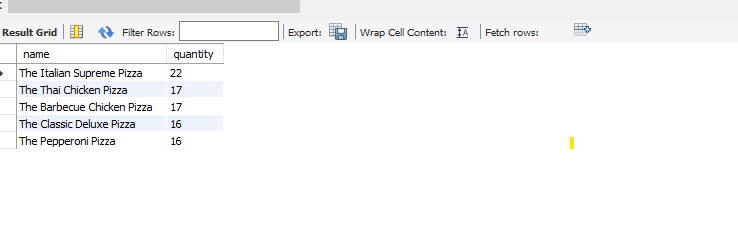
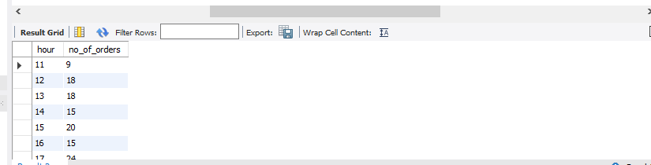
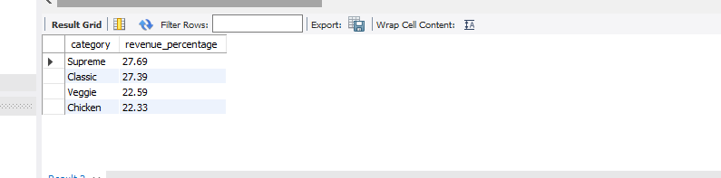

#  Pizza Sales Analysis Using SQL

##  Project Overview
This project analyzes pizza sales data using MySQL to uncover valuable business insights. The analysis focuses on revenue generation, customer ordering behavior, product performance, and sales trends.

The project demonstrates the practical use of SQL for data analysis by solving real-world business questions using multiple tables, joins, aggregate functions, grouping, sorting, and subqueries.

---

##  Objectives
- Analyze overall pizza sales performance.
- Calculate total revenue generated from sales.
- Identify the highest-priced pizza.
- Find the most commonly ordered pizza size.
- Determine the top-selling pizzas.
- Analyze category-wise sales performance.
- Study customer ordering patterns by hour.
- Generate business insights from sales data.

---

##  Tools & Technologies
- MySQL Workbench
- SQL
- GitHub
- CSV Dataset

---

##  Dataset Information

The project uses 4 related tables:

| Table | Key Columns |
|---|---|
| orders | order_id, date, time |
| order_details | order_details_id, order_id, pizza_id, quantity |
| pizzas | pizza_id, pizza_type_id, size, price |
| pizza_types | pizza_type_id, name, category, ingredients |

---

##  SQL Concepts Used
- SELECT Statements
- Aggregate Functions (SUM, COUNT, AVG)
- INNER JOIN (multiple tables)
- GROUP BY & ORDER BY
- LIMIT
- Subqueries
- Revenue Analysis

---

##  Business Questions Solved

###  Basic Analysis
1. Retrieve the total number of orders placed.
2. Calculate the total revenue generated from pizza sales.
3. Identify the highest-priced pizza.
4. Determine the most common pizza size ordered.

###  Intermediate Analysis
5. Find the top 5 most ordered pizza types.

**Result:**

6. Calculate the total quantity ordered by pizza category.
7. Analyze order distribution by hour of the day.

**Result:**

8. Determine category-wise pizza distribution.
9. Calculate the average number of pizzas ordered per day.

### Advanced Analysis
10. Identify the top 3 revenue-generating pizza types.
11. Calculate the percentage contribution of each pizza category to total revenue.

**Result:**

---

## Key Insights
- **The Italian Supreme Pizza** is the most ordered pizza.
- **Supreme category** contributes the highest revenue at **27.69%**.
- Peak ordering hours are between **12 PM – 1 PM** and **5 PM – 7 PM**.

---

## Learning Outcomes
Through this project, I gained hands-on experience in:
- Writing SQL queries for business analysis
- Working with relational datasets
- Performing revenue and sales analysis
- Using joins to combine multiple tables
- Generating insights from raw data
- Solving real-world analytical problems using SQL

---

##  Author
**Ishika Sharma**
BCA Student | SQL & Data Analytics Enthusiast
